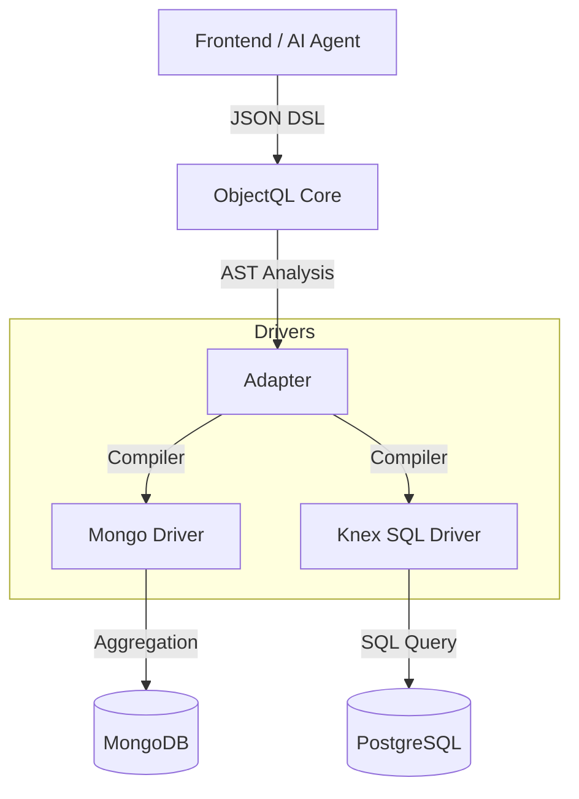

# ObjectQL

**One Protocol, Any Database, AI-Ready.**

A universal data query engine for the modern stack.

Write your logic once in JSON-DSL, run it seamlessly on MongoDB (Schema-less) or PostgreSQL (Schema-strict).

---

## 📖 Introduction

**ObjectQL** is a standalone, open-source query engine designed to bridge the gap between flexible design and structured storage.

In modern application development, developers often face a dilemma:

1. **Design Phase:** You want the flexibility of **NoSQL (MongoDB)** to iterate fast, change schemas on the fly, and handle dynamic fields.
2. **Production Phase:** You need the reliability, transactions, and reporting capabilities of **SQL (PostgreSQL)**.

ObjectQL solves this by providing a unified **JSON-DSL (Domain Specific Language)**. It acts as a transpiler that compiles your abstract query logic into optimized native queries for whichever database you are running on.

It is **not** an ORM, but a high-level data protocol designed for AI agents, low-code engines, and dynamic API layers.

## ✨ Key Features

* **🚀 Dual-Stack Engine:**
* **Mongo Driver:** Native performance for schema-less data and rapid prototyping.
* **Knex SQL Driver:** First-class support for PostgreSQL, MySQL, and SQLite. It uniquely employs a "Core Columns + JSONB" strategy to handle dynamic fields within a relational structure.


* **🤖 AI-Native Protocol:**
* Queries are defined as standardized **JSON ASTs** (Abstract Syntax Trees), not string concatenation.
* This structure is optimized for LLMs (like ChatGPT/Claude) to understand schema and generate accurate, safe business logic without hallucinating SQL syntax.


* **⚡ Modern & Lightweight:**
* Written in 100% **TypeScript**.
* **Zero heavy legacy dependencies.** No runtime environment requirements beyond Node.js.
* Promise-based asynchronous API.


* **🔌 Pluggable Architecture:**
* The core logic is completely decoupled from storage drivers.
* Easily extensible to support other data sources (e.g., REST APIs, GraphQL, SQLite).


## 📦 Installation

```bash
# Install the core engine
npm install @objectql/core

# Install drivers as needed
npm install @objectql/driver-mongo
npm install @objectql/driver-knex

```

## ⚡ Quick Start

### 1. Initialize ObjectQL

```typescript
import { ObjectQL } from '@objectql/core';
import { MongoDriver } from '@objectql/driver-mongo';
import { KnexDriver } from '@objectql/driver-knex';

const app = new ObjectQL({
  datasources: {
    // Environment A: Cloud / Prototype (MongoDB)
    design: new MongoDriver({ url: process.env.MONGO_URL }),
    
    // Environment B: On-Premise / Production (PostgreSQL)
    runtime: new KnexDriver({ client: 'pg', connection: process.env.PG_URL })
  }
});

```

### 2. The Unified Query (JSON-DSL)

This syntax is consistent regardless of the underlying database. It is designed to be easily generated by frontend UI builders or AI agents.

```typescript
// Example: Find orders with amount > 1000 and expand customer details
const query = {
  entity: 'orders',
  fields: ['id', 'order_no', 'amount', 'created_at'],
  filters: [
    ['status', '=', 'paid'],
    'and',
    ['amount', '>', 1000]
  ],
  sort: [['created_at', 'desc']],
  expand: {
    customer: {
      fields: ['name', 'email']
    }
  }
};

// Option A: Execute on MongoDB
// ObjectQL compiles this to an Aggregation Pipeline
const resultsMongo = await app.datasource('design').find(query);

// Option B: Execute on PostgreSQL
// ObjectQL compiles this to a SQL query with JSONB operators and JOINs
const resultsSql = await app.datasource('runtime').find(query);

```

## 🏗 Architecture

ObjectQL follows a strict separation of concerns, acting as a compiler between your intent (DSL) and the execution (Driver).



## 🛣 Roadmap

* [ ] **Phase 1: Core Protocol:** Define stable `UnifiedQuery` types and AST parser.
* [ ] **Phase 2: Mongo Driver:** Implement full CRUD and Aggregation support.
* [ ] **Phase 3: SQL Driver:** Implement the "Hybrid Storage" strategy (Relational Columns + JSONB).
* [ ] **Phase 4: CLI Tools:** Schema synchronization and TypeScript type generation (`objectql generate`).
* [ ] **Phase 5: AI Integration:** Natural language queries, schema generation, and AI-powered analytics.

## 🤖 AI Capabilities

ObjectQL is designed to be **AI-native** from the ground up:

* **Natural Language to Queries**: Convert plain English to database queries
* **Schema Generation**: Generate object definitions from business requirements
* **AI-Powered Analytics**: Automated insights and trend detection
* **Safe AI Operations**: Built-in validation, sandboxing, and rate limiting

See our [AI Integration Guide](./docs/guide/ai-integration.md) and [AI Capabilities Roadmap](./docs/AI_CAPABILITIES_ROADMAP.md) for details.

## 🤝 Contributing

We welcome contributions! This project is intended to be the foundation for the next generation of data-driven applications.

## 📄 License

MIT © [ObjectQL Contributors](https://github.com/objectql)
