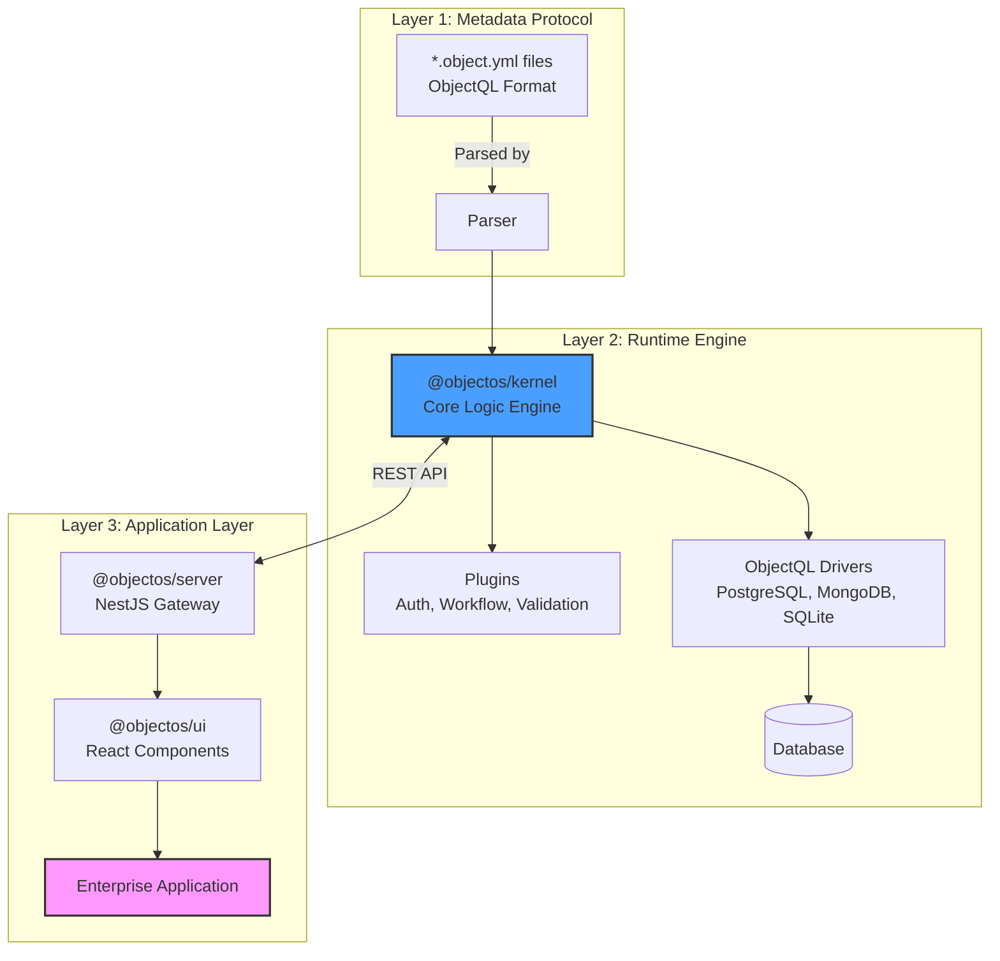

# ObjectOS

<div align="center">

**Open-source alternative to Salesforce & Airtable.**
*A full-stack low-code platform with metadata-driven backend and auto-generated React UI.*

[Documentation](https://objectos.org) · [Protocol Specs](https://github.com/objectql/objectql) · [AI Builder](https://www.builder6.ai)

</div>

---

## 📖 Introduction

**ObjectOS** is a high-performance, metadata-driven runtime engine that brings your enterprise applications to life.

### The Two-Layer Architecture

1. **[ObjectQL](https://github.com/objectql/objectql)** - The Metadata Standard
   - Defines the protocol for describing business objects, fields, relationships, and logic
   - Pure specification in YAML format (`*.object.yml`)
   - Enables AI and tools to generate massive amounts of enterprise metadata

2. **ObjectOS** - The Runtime Engine (This Repository)
   - Interprets and executes ObjectQL metadata
   - Generates fully functional enterprise applications from metadata
   - Provides the kernel, drivers, server, and UI components

Think of it as **ObjectQL is the blueprint language, ObjectOS is the builder**.

### What You Get

Most platforms force you to choose: flexibility (like **Airtable**) or structure (like **Salesforce**). ObjectOS gives you both in a single, open-source package.

By defining your business logic in standard `*.object.yml` files, ObjectOS instantly generates:

1. **A Powerful Backend:** Node.js kernel with built-in Auth, Permissions (RBAC/RLS), and Workflow.
2. **A Unified Frontend:** A React application that combines high-performance Data Grids with enterprise-grade Detail Forms.
3. **Database Agnostic:** Works with PostgreSQL, MongoDB, or SQLite through pluggable drivers.

## ✨ Key Features

### 🖥️ The Unified UI (Hybrid Experience)

Stop building separate "Admin Panels" and "Dashboards".

* **Grid View (Airtable-like):** Powered by **TanStack Table**. Supports resizing, sorting, and inline editing for mass data entry.
* **Detail Drawer (Salesforce-like):** Click any row to slide out a structured form with related lists and activity feeds.
* **Auto-Generated:** Zero frontend code required. Rendered dynamically from metadata.

### ⚙️ The Metadata Engine

* **Protocol Driven:** Describes data, validation, and layout in pure YAML.
* **Database Agnostic:** Runs on PostgreSQL, MongoDB, or SQLite.
* **Enterprise Security:** Field-level security and record-level sharing rules out of the box.

### 🤖 AI-First Architecture

ObjectOS is designed to be the "Execution Layer" for AI.

* Don't write boilerplate. Let AI generate your `object.yml` and complex formulas.
* The runtime handles the heavy lifting (CRUD, Validation, State Management).

---

## 🏗 Architecture

ObjectOS implements a clean three-layer architecture following the principle:

> **"Kernel handles logic, Drivers handle data, Server handles HTTP."**



### Key Design Principles

1. **Metadata-First**: Everything is defined declaratively in YAML
2. **Protocol-Driven**: ObjectOS strictly implements the ObjectQL protocol
3. **Database Agnostic**: Swap databases without changing business logic
4. **Separation of Concerns**: Kernel never touches HTTP, Server never touches SQL

---

## 🚀 Quick Start

Build a CRM in less than a minute.

### 1. Create a Project

```bash
npx create-objectos-app my-company
cd my-company
npm install

```

### 2. Define an Object

Create `objects/deal.object.yml`:

```yaml
name: deals
label: Sales Deal
icon: dollar-sign
fields:
  title:
    type: text
    required: true
  amount:
    type: currency
    scale: 2
  stage:
    type: select
    options: ["New", "Negotiation", "Won", "Lost"]
  close_date:
    type: date

```

### 3. Run the Platform

```bash
npm run dev

```

Visit `http://localhost:3000`.
You will see a **Data Grid** for Deals. Click "New" to see the **Form**. All CRUD operations work instantly.

---

## 📦 Ecosystem

| Package | Description | Role |
| --- | --- | --- |
| **`@objectos/kernel`** | Core runtime engine that loads metadata, manages object registry, and coordinates data operations | Brain of ObjectOS |
| **`@objectos/server`** | NestJS-based HTTP server that exposes REST APIs for CRUD operations | API Gateway |
| **`@objectos/ui`** | React component library for building enterprise UIs (grids, forms, charts) | Frontend Components |
| **`@objectos/preset-base`** | Standard metadata presets (User, Role, Permission objects) | Pre-built Objects |

### External Dependencies

| Package | Source | Purpose |
| --- | --- | --- |
| **`@objectql/core`** | [objectql/objectql](https://github.com/objectql/objectql) | Metadata parser and validator |
| **`@objectql/types`** | [objectql/objectql](https://github.com/objectql/objectql) | TypeScript type definitions for ObjectQL protocol |
| **`@objectql/driver-sql`** | [objectql/objectql](https://github.com/objectql/objectql) | PostgreSQL/MySQL/SQLite driver implementation |
| **`@objectql/driver-mongo`** | [objectql/objectql](https://github.com/objectql/objectql) | MongoDB driver implementation |

---

## 🤝 Contributing

We are building the future of open-source business software.

* **Core Protocol:** Contribute to [objectql/objectql](https://github.com/objectql/objectql).
* **Runtime & UI:** Submit PRs to this repository.
* **Read the Guide:** See [CONTRIBUTING.md](./CONTRIBUTING.md) for detailed guidelines.

## 📚 Documentation

- **[Quick Reference](./QUICK_REFERENCE.md)** - Command reference and common patterns
- **[Architecture](./ARCHITECTURE.md)** - Deep dive into the three-layer architecture
- **[Roadmap](./ROADMAP.md)** - Development plan and feature roadmap
- **[Contributing Guide](./CONTRIBUTING.md)** - How to contribute to ObjectOS
- **[Online Documentation](https://objectos.org)** - Full guides and API reference

## 📄 License

MIT © [ObjectOS Team](https://objectos.org)