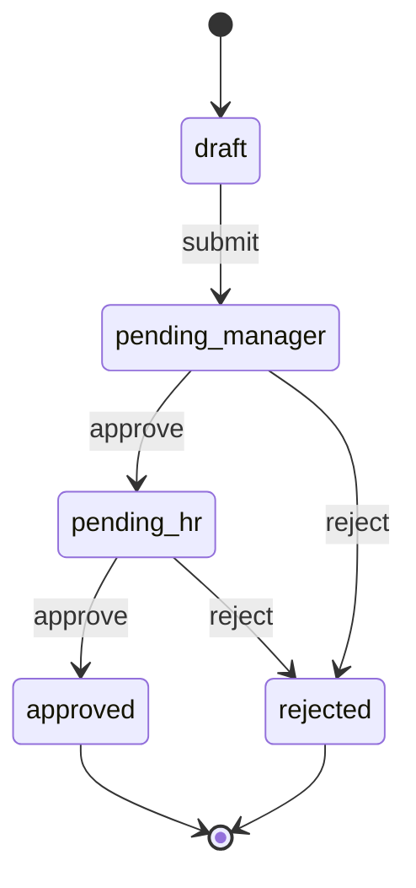

# Workflow Engine State Machine Design: Business Process Automation

> **Author**: ObjectOS Core Team  
> **Date**: January 2026  
> **Version**: 1.0  
> **Target Audience**: Business Analysts, Backend Engineers

---

## Executive Summary

ObjectOS implements a **declarative workflow engine** based on **Finite State Machines (FSM)** that enables business process automation without writing imperative code. This article explores the state machine design, execution model, and advanced features like parallel execution, error handling, and human-in-the-loop approvals.

**Core Challenge**: How do we model complex business processes (approvals, notifications, data transformations) as configuration rather than code?

---

## 1. The Workflow Philosophy

### 1.1 What is a Workflow?

**Definition**: A workflow is a **sequence of steps** that transforms data from one state to another, often involving human decisions or external system interactions.

**Example: Leave Request Approval**

```
Draft → Submit → Manager Review → HR Review → Approved/Rejected
```

**Traditional Code-First Approach**:

```typescript
// ❌ Hardcoded logic scattered everywhere
async function submitLeaveRequest(requestId) {
  const request = await db.findOne('leave_requests', requestId);
  
  if (request.days > 5) {
    request.status = 'pending_hr';
    await sendEmail(hrManager, 'New leave request');
  } else {
    request.status = 'pending_manager';
    await sendEmail(request.manager, 'New leave request');
  }
  
  await db.update('leave_requests', requestId, request);
}

async function approveLeaveRequest(requestId) {
  const request = await db.findOne('leave_requests', requestId);
  
  if (request.status === 'pending_manager') {
    request.status = 'pending_hr';
    await sendEmail(hrManager, 'Leave approved by manager');
  } else if (request.status === 'pending_hr') {
    request.status = 'approved';
    await sendEmail(request.employee, 'Leave approved');
    await updateCalendar(request);
  }
  
  await db.update('leave_requests', requestId, request);
}
```

**Problems**:
- Business logic scattered across multiple functions
- Hard to visualize the flow
- Changes require code deployment
- No audit trail of state transitions

**ObjectOS Workflow-First Approach**:

```yaml
# workflows/leave_request.yml
name: leave_request_approval
object: leave_requests

states:
  draft:
    initial: true
    transitions:
      submit: pending_manager
  
  pending_manager:
    transitions:
      approve: pending_hr
      reject: rejected
    on_enter:
      - action: send_email
        to: "{{ record.manager.email }}"
        subject: "Leave Request Awaiting Approval"
  
  pending_hr:
    transitions:
      approve: approved
      reject: rejected
    on_enter:
      - action: send_email
        to: "hr@example.com"
        subject: "Leave Request Awaiting HR Approval"
  
  approved:
    final: true
    on_enter:
      - action: send_email
        to: "{{ record.employee.email }}"
        subject: "Leave Request Approved"
      - action: update_calendar
  
  rejected:
    final: true
    on_enter:
      - action: send_email
        to: "{{ record.employee.email }}"
        subject: "Leave Request Rejected"
```

**Benefits**:
- ✅ Visual flow (can be rendered as diagram)
- ✅ Declarative (what, not how)
- ✅ Auditable (every transition logged)
- ✅ No-code changes (business users can modify)

---

## 2. Finite State Machine Theory

### 2.1 FSM Components

**A Finite State Machine consists of**:

1. **States**: Distinct conditions (e.g., `draft`, `pending`, `approved`)
2. **Transitions**: Allowed movements between states (e.g., `submit`, `approve`)
3. **Events**: Triggers that cause transitions (e.g., user clicks "Submit")
4. **Actions**: Side effects during transitions (e.g., send email)
5. **Guards**: Conditions that must be true for transition (e.g., `days <= 10`)

**Mathematical Representation**:

```
FSM = (S, E, T, s₀, F)

Where:
  S = Set of states
  E = Set of events
  T = Transition function: S × E → S
  s₀ = Initial state
  F = Set of final states
```

### 2.2 FSM Properties

**Determinism**: Given a state and event, there is exactly one next state.

```yaml
# ✅ Deterministic
pending:
  transitions:
    approve: approved

# ❌ Non-deterministic (ambiguous)
pending:
  transitions:
    approve: approved
    approve: rejected  # Which one?
```

**Reachability**: All states are reachable from initial state.

```yaml
# ❌ Unreachable state
draft:
  transitions:
    submit: pending
pending:
  transitions:
    approve: approved
rejected:  # No way to reach this state!
  transitions: {}
```

---

## 3. Workflow Definition Language

### 3.1 State Definition

```yaml
states:
  <state_name>:
    # Metadata
    label: "Human-readable name"
    description: "What this state means"
    
    # Initial/Final markers
    initial: true | false
    final: true | false
    
    # Transitions
    transitions:
      <event_name>: <target_state>
      <event_name>:
        target: <target_state>
        guard: "{{ condition }}"
        actions:
          - action: <action_name>
            params: { ... }
    
    # Lifecycle hooks
    on_enter:
      - action: <action_name>
    on_exit:
      - action: <action_name>
    
    # Timeouts
    timeout:
      duration: 3600  # seconds
      on_timeout: <target_state>
```

### 3.2 Transition Guards

**Use Case**: Only allow approval if conditions are met.

```yaml
pending_manager:
  transitions:
    approve:
      target: approved
      guard: "{{ record.days <= 5 }}"  # Short leave: direct approval
    
    escalate:
      target: pending_hr
      guard: "{{ record.days > 5 }}"   # Long leave: needs HR
```

**Guard Evaluation**:

```typescript
function evaluateGuard(guard: string, context: any): boolean {
  // Parse template
  const condition = parseTemplate(guard, context);
  
  // Evaluate as JavaScript expression
  return eval(condition);  // In production, use safe eval (vm2)
}

// Example
evaluateGuard("{{ record.days <= 5 }}", { record: { days: 3 } });
// Returns: true
```

### 3.3 Actions

**Built-in Actions**:

```yaml
on_enter:
  # Send email
  - action: send_email
    to: "{{ record.manager.email }}"
    subject: "New Leave Request"
    template: "email/leave_request"
  
  # Update record
  - action: update_record
    object: leave_requests
    id: "{{ record.id }}"
    data:
      reviewed_at: "{{ now() }}"
  
  # Call webhook
  - action: http_post
    url: "https://api.example.com/notify"
    body:
      event: "leave_approved"
      data: "{{ record }}"
  
  # Execute custom code
  - action: run_script
    script: "./scripts/update_calendar.js"
    args:
      record: "{{ record }}"
```

**Custom Actions**:

```typescript
// Register custom action
kernel.registerAction('update_calendar', async (context, params) => {
  const { record } = params;
  
  await calendarAPI.createEvent({
    title: `${record.employee.name} - Leave`,
    start: record.start_date,
    end: record.end_date
  });
});
```

---

## 4. Workflow Engine Architecture

### 4.1 Core Components

```
┌──────────────────────────────────────────────────────┐
│              Workflow Engine                         │
├──────────────────────────────────────────────────────┤
│                                                      │
│  ┌────────────────┐      ┌────────────────┐         │
│  │  State Machine │      │  Action        │         │
│  │  Executor      │◀────▶│  Executor      │         │
│  └────────────────┘      └────────────────┘         │
│          │                       │                  │
│          │                       │                  │
│          ▼                       ▼                  │
│  ┌────────────────┐      ┌────────────────┐         │
│  │  Workflow      │      │  Event Queue   │         │
│  │  Registry      │      │  (Redis)       │         │
│  └────────────────┘      └────────────────┘         │
│                                                      │
└──────────────────────────────────────────────────────┘
```

### 4.2 State Machine Executor

```typescript
// @objectos/workflow/src/StateMachineExecutor.ts
export class StateMachineExecutor {
  async execute(
    workflow: WorkflowDefinition,
    record: any,
    event: string
  ): Promise<ExecutionResult> {
    // 1. Get current state
    const currentState = record._workflow_state || workflow.initial;
    const state = workflow.states[currentState];
    
    // 2. Find transition
    const transition = state.transitions[event];
    if (!transition) {
      throw new Error(`No transition '${event}' from state '${currentState}'`);
    }
    
    // 3. Evaluate guard
    if (transition.guard) {
      const allowed = this.evaluateGuard(transition.guard, { record });
      if (!allowed) {
        throw new Error('Transition guard failed');
      }
    }
    
    // 4. Execute exit actions
    await this.executeActions(state.on_exit, { record });
    
    // 5. Transition to next state
    const nextState = transition.target;
    record._workflow_state = nextState;
    
    // 6. Execute transition actions
    await this.executeActions(transition.actions, { record });
    
    // 7. Execute entry actions
    await this.executeActions(workflow.states[nextState].on_enter, { record });
    
    // 8. Save record
    await this.db.update(workflow.object, record.id, record);
    
    // 9. Log transition
    await this.logTransition({
      workflow: workflow.name,
      record_id: record.id,
      from: currentState,
      to: nextState,
      event,
      timestamp: new Date()
    });
    
    return {
      success: true,
      from: currentState,
      to: nextState,
      record
    };
  }
}
```

### 4.3 Action Executor

```typescript
// @objectos/workflow/src/ActionExecutor.ts
export class ActionExecutor {
  private handlers = new Map<string, ActionHandler>();
  
  registerAction(name: string, handler: ActionHandler): void {
    this.handlers.set(name, handler);
  }
  
  async executeActions(
    actions: ActionDefinition[],
    context: any
  ): Promise<void> {
    for (const action of actions || []) {
      await this.executeAction(action, context);
    }
  }
  
  private async executeAction(
    action: ActionDefinition,
    context: any
  ): Promise<void> {
    const handler = this.handlers.get(action.action);
    if (!handler) {
      throw new Error(`Unknown action: ${action.action}`);
    }
    
    // Resolve parameters (template substitution)
    const params = this.resolveParams(action.params, context);
    
    // Execute
    try {
      await handler(context, params);
    } catch (error) {
      this.logger.error(`Action ${action.action} failed:`, error);
      
      // Retry logic
      if (action.retry) {
        await this.retryAction(action, context, params);
      } else {
        throw error;
      }
    }
  }
  
  private resolveParams(params: any, context: any): any {
    return mapValues(params, (value) => {
      if (typeof value === 'string' && value.includes('{{')) {
        return parseTemplate(value, context);
      }
      return value;
    });
  }
}
```

---

## 5. Advanced Features

### 5.1 Parallel States

**Use Case**: Order fulfillment (packaging + payment processing happen concurrently)

```yaml
name: order_fulfillment

states:
  processing:
    type: parallel
    substates:
      payment:
        initial: pending_payment
        states:
          pending_payment:
            transitions:
              charge: payment_complete
          payment_complete:
            final: true
      
      inventory:
        initial: reserving
        states:
          reserving:
            transitions:
              reserve: packing
          packing:
            transitions:
              pack: ready_to_ship
          ready_to_ship:
            final: true
    
    # Transition when ALL substates are final
    on_all_complete:
      target: ready_to_ship
```

**Execution**:

```typescript
async executeParallelState(state: ParallelState, record: any): Promise<void> {
  // Execute all substates in parallel
  const promises = Object.entries(state.substates).map(([name, substate]) => {
    return this.executeSubstate(substate, record);
  });
  
  await Promise.all(promises);
  
  // Check if all substates are in final state
  const allComplete = Object.values(state.substates).every(s => 
    s.current in s.final_states
  );
  
  if (allComplete) {
    await this.transition(record, state.on_all_complete.target);
  }
}
```

### 5.2 Conditional Branching

**Use Case**: Route based on data values

```yaml
review:
  transitions:
    submit:
      - target: auto_approved
        guard: "{{ record.amount < 1000 }}"
      
      - target: manager_review
        guard: "{{ record.amount >= 1000 && record.amount < 10000 }}"
      
      - target: executive_review
        guard: "{{ record.amount >= 10000 }}"
      
      - target: error
        # Default case (no guard)
```

### 5.3 Timeouts & Escalation

**Use Case**: Auto-escalate if manager doesn't respond in 24 hours

```yaml
pending_manager:
  timeout:
    duration: 86400  # 24 hours in seconds
    on_timeout: escalated
    actions:
      - action: send_email
        to: "{{ record.manager.manager.email }}"
        subject: "Escalated: Leave Request Pending"
  
  transitions:
    approve: approved
    reject: rejected
```

**Implementation**:

```typescript
async scheduleTimeout(
  workflow: string,
  recordId: string,
  state: string,
  duration: number
): Promise<void> {
  // Use job queue (Bull/BullMQ)
  await this.queue.add(
    'workflow-timeout',
    { workflow, recordId, state },
    { delay: duration * 1000 }
  );
}

// Job processor
async processTimeout(job: Job): Promise<void> {
  const { workflow, recordId, state } = job.data;
  
  const record = await this.db.findOne(workflow.object, recordId);
  
  // Check if still in same state
  if (record._workflow_state === state) {
    const timeoutTarget = workflow.states[state].timeout.on_timeout;
    await this.transition(record, timeoutTarget);
  }
}
```

### 5.4 Human-in-the-Loop Approvals

**Use Case**: Wait for human approval before proceeding

```yaml
pending_approval:
  type: approval
  approvers:
    - "{{ record.manager.id }}"
    - "{{ record.department_head.id }}"
  
  approval_rule: any  # 'any', 'all', or 'majority'
  
  transitions:
    approve: approved
    reject: rejected
    
  on_enter:
    - action: create_approval_task
      assignees: "{{ approvers }}"
      due_date: "{{ now() + 86400 }}"  # 24 hours
```

**Approval UI**:

```typescript
// API endpoint for approvals
app.post('/api/workflows/:workflow/records/:id/approve', async (req, res) => {
  const { workflow, id } = req.params;
  const { decision, comments } = req.body;
  
  await workflowEngine.recordApproval({
    workflow,
    recordId: id,
    userId: req.user.id,
    decision,
    comments
  });
  
  // Check if approval threshold met
  const approved = await workflowEngine.checkApprovalThreshold(workflow, id);
  if (approved) {
    await workflowEngine.transition(workflow, id, 'approve');
  }
});
```

---

## 6. Workflow Visualization

### 6.1 State Diagram Generation

**Generate Mermaid diagram from YAML**:

```typescript
function generateDiagram(workflow: WorkflowDefinition): string {
  let mermaid = 'stateDiagram-v2\n';
  
  for (const [name, state] of Object.entries(workflow.states)) {
    if (state.initial) {
      mermaid += `  [*] --> ${name}\n`;
    }
    
    for (const [event, target] of Object.entries(state.transitions || {})) {
      const targetState = typeof target === 'string' ? target : target.target;
      mermaid += `  ${name} --> ${targetState}: ${event}\n`;
    }
    
    if (state.final) {
      mermaid += `  ${name} --> [*]\n`;
    }
  }
  
  return mermaid;
}
```

**Generated Diagram**:



### 6.2 Runtime State Visualization

**Show current state on record**:

```typescript
<WorkflowVisualizer 
  workflow={leaveRequestWorkflow}
  currentState={record._workflow_state}
  history={record._workflow_history}
/>
```

**Displays**:
- Current state (highlighted)
- Available transitions (enabled buttons)
- Transition history (timeline)

---

## 7. Error Handling & Recovery

### 7.1 Compensation Actions

**Use Case**: Rollback changes if workflow fails

```yaml
states:
  processing:
    on_enter:
      - action: reserve_inventory
        compensation: release_inventory
      
      - action: charge_payment
        compensation: refund_payment
    
    transitions:
      success: completed
      error: failed
  
  failed:
    on_enter:
      - action: run_compensations  # Automatically executes compensation actions
```

### 7.2 Retry Logic

```yaml
states:
  sending_notification:
    on_enter:
      - action: send_email
        retry:
          max_attempts: 3
          backoff: exponential
          initial_delay: 5000  # 5 seconds
```

**Implementation**:

```typescript
async retryAction(
  action: ActionDefinition,
  context: any,
  params: any
): Promise<void> {
  const { max_attempts, backoff, initial_delay } = action.retry;
  
  for (let attempt = 1; attempt <= max_attempts; attempt++) {
    try {
      await this.executeAction(action, context, params);
      return;  // Success
    } catch (error) {
      if (attempt === max_attempts) {
        throw error;  // Max retries exhausted
      }
      
      // Calculate delay
      const delay = backoff === 'exponential'
        ? initial_delay * Math.pow(2, attempt - 1)
        : initial_delay;
      
      await sleep(delay);
    }
  }
}
```

---

## 8. Performance & Scalability

### 8.1 Workflow Execution Queue

**Problem**: Synchronous execution blocks request

```typescript
// ❌ BAD: Blocks HTTP response
app.post('/leave-requests/:id/submit', async (req, res) => {
  await workflowEngine.transition(req.params.id, 'submit');  // May take 10s
  res.json({ success: true });
});
```

**Solution**: Async execution with queue

```typescript
// ✅ GOOD: Return immediately, process in background
app.post('/leave-requests/:id/submit', async (req, res) => {
  await workflowQueue.add({
    workflow: 'leave_request',
    recordId: req.params.id,
    event: 'submit'
  });
  
  res.json({ success: true, status: 'queued' });
});

// Worker processes queue
workflowQueue.process(async (job) => {
  const { workflow, recordId, event } = job.data;
  await workflowEngine.transition(workflow, recordId, event);
});
```

### 8.2 Bulk Operations

**Use Case**: Approve 100 leave requests at once

```typescript
async bulkTransition(
  workflow: string,
  recordIds: string[],
  event: string
): Promise<BulkResult> {
  const results = await Promise.allSettled(
    recordIds.map(id => this.transition(workflow, id, event))
  );
  
  return {
    succeeded: results.filter(r => r.status === 'fulfilled').length,
    failed: results.filter(r => r.status === 'rejected').length,
    errors: results
      .filter(r => r.status === 'rejected')
      .map(r => r.reason)
  };
}
```

---

## 9. Workflow Analytics

### 9.1 State Duration Metrics

**Track time spent in each state**:

```typescript
// Log state entry
await this.db.insert('workflow_metrics', {
  workflow: 'leave_request',
  record_id: record.id,
  state: 'pending_manager',
  entered_at: new Date()
});

// On exit, calculate duration
const metric = await this.db.findOne('workflow_metrics', {
  workflow: 'leave_request',
  record_id: record.id,
  state: 'pending_manager',
  exited_at: null
});

metric.exited_at = new Date();
metric.duration = metric.exited_at - metric.entered_at;

await this.db.update('workflow_metrics', metric.id, metric);
```

**Analytics Query**:

```sql
SELECT 
  state,
  AVG(duration) as avg_duration,
  MAX(duration) as max_duration
FROM workflow_metrics
WHERE workflow = 'leave_request'
GROUP BY state;
```

**Result**:

```
state              avg_duration    max_duration
-------------------------------------------------
pending_manager    3600000 (1h)    86400000 (24h)
pending_hr         7200000 (2h)    172800000 (48h)
```

### 9.2 Bottleneck Detection

**Identify states with longest wait times**:

```typescript
const bottlenecks = await this.db.query(`
  SELECT state, COUNT(*) as stuck_count
  FROM workflow_states
  WHERE workflow = 'leave_request'
    AND duration > 86400000  -- > 24 hours
  GROUP BY state
  ORDER BY stuck_count DESC
`);

// Alert if bottleneck detected
if (bottlenecks[0].stuck_count > 10) {
  await alertAdmin(`Bottleneck detected in state: ${bottlenecks[0].state}`);
}
```

---

## 10. Testing Strategies

### 10.1 State Machine Tests

```typescript
describe('Leave Request Workflow', () => {
  let workflow: WorkflowDefinition;
  let executor: StateMachineExecutor;
  
  beforeEach(() => {
    workflow = loadWorkflow('leave_request');
    executor = new StateMachineExecutor(workflow);
  });
  
  it('should transition from draft to pending on submit', async () => {
    const record = { id: '123', _workflow_state: 'draft', days: 3 };
    
    const result = await executor.execute(workflow, record, 'submit');
    
    expect(result.to).toBe('pending_manager');
  });
  
  it('should reject transition if guard fails', async () => {
    const record = { id: '123', _workflow_state: 'pending', days: 100 };
    
    await expect(
      executor.execute(workflow, record, 'auto_approve')
    ).rejects.toThrow('Transition guard failed');
  });
});
```

### 10.2 Action Tests

```typescript
describe('Send Email Action', () => {
  it('should send email with correct params', async () => {
    const mockEmail = jest.fn();
    const executor = new ActionExecutor();
    
    executor.registerAction('send_email', mockEmail);
    
    await executor.executeAction({
      action: 'send_email',
      params: {
        to: 'test@example.com',
        subject: 'Test'
      }
    }, {});
    
    expect(mockEmail).toHaveBeenCalledWith(
      expect.anything(),
      { to: 'test@example.com', subject: 'Test' }
    );
  });
});
```

---

## 11. Best Practices

### 11.1 Workflow Design Principles

**1. Keep States Simple**: Each state should represent a single, clear condition

```yaml
# ✅ GOOD
states:
  pending_manager_review:
    ...
  pending_hr_review:
    ...

# ❌ BAD (ambiguous)
states:
  pending:
    # Is this manager or HR?
```

**2. Use Guards for Business Rules**: Don't encode logic in state names

```yaml
# ✅ GOOD
review:
  transitions:
    submit:
      target: auto_approved
      guard: "{{ record.amount < 1000 }}"

# ❌ BAD
review_small_amount:
  transitions:
    submit: auto_approved
review_large_amount:
  transitions:
    submit: manager_review
```

**3. Limit State Count**: More than 10 states → consider nested workflows

### 11.2 Error Handling

**Always define error states**:

```yaml
states:
  processing:
    transitions:
      success: completed
      error: failed  # Don't forget error paths!
  
  failed:
    on_enter:
      - action: notify_admin
      - action: rollback_changes
```

---

## 12. Conclusion

The ObjectOS Workflow Engine achieves **process automation** through:

1. **Finite State Machine Design**: Formal model for business processes
2. **Declarative Workflow Language**: YAML-based, no-code definitions
3. **Action System**: Extensible side effects (email, webhooks, scripts)
4. **Advanced Features**: Parallel states, timeouts, approvals
5. **Async Execution**: Queue-based for scalability

**Key Insight**: By modeling business processes as **state machines**, ObjectOS enables non-developers to define, visualize, and modify workflows without touching code.

---

**Series Complete**: [Return to Analysis Index](./README.md)
